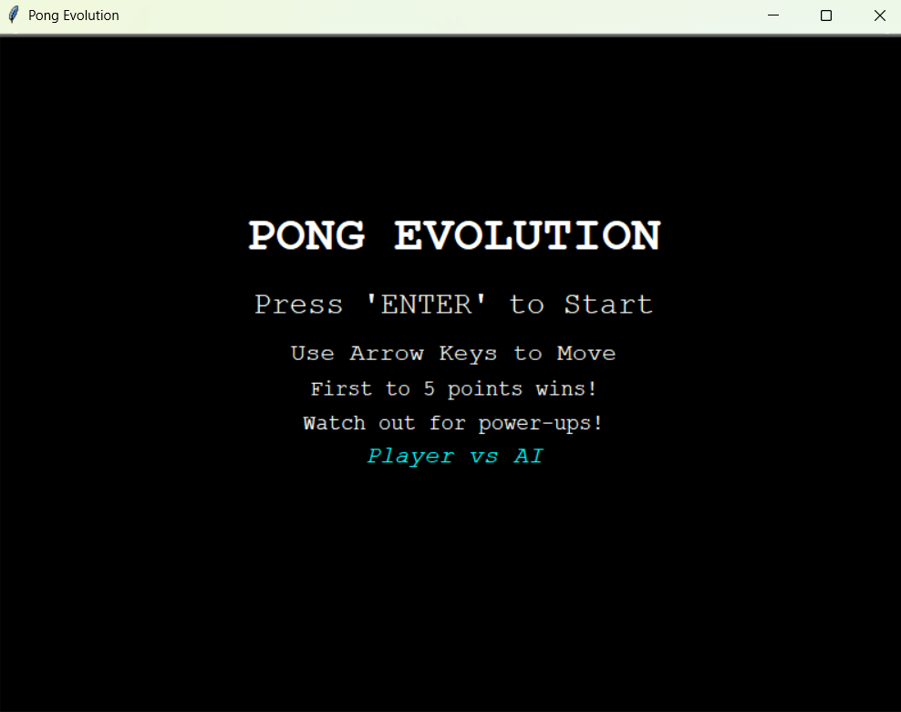
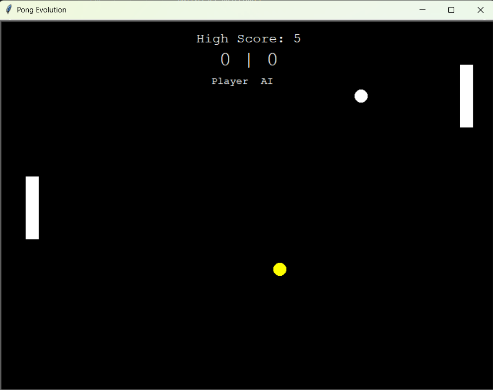
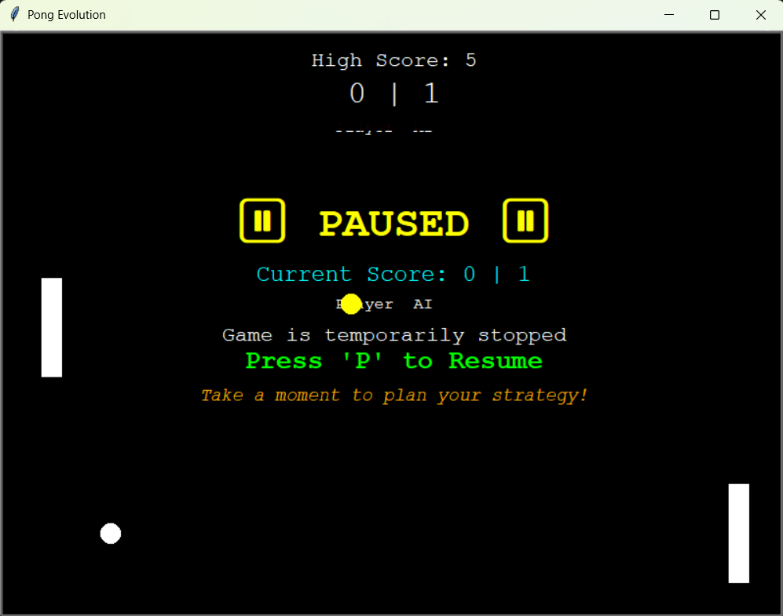
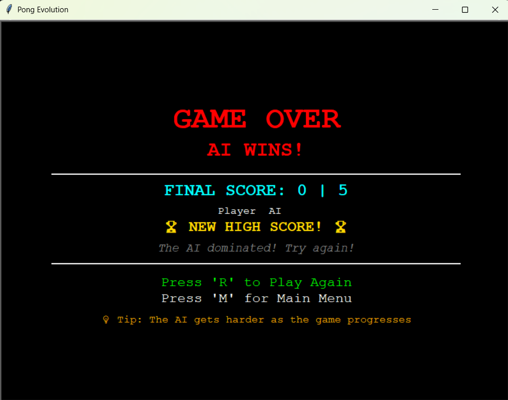

# Pong Evolution

## Overview

- **Pong Evolution** is an enhanced version of the classic Pong game built with Python's Turtle graphics. 
- This modern take on the retro classic features AI opponents, power-ups, enhanced UI, high score tracking, and smooth gameplay mechanics that bring fresh excitement to the beloved game.

### Features
- **AI Opponent**: Play against a smart computer-controlled paddle with responsive AI
- **Power-ups**: Random power-ups spawn during gameplay:
- **Size Up**: Increases paddle size for easier ball returns
- **Speed Up**: Increases ball speed for more intense gameplay
- **Progressive Difficulty**: Ball speed increases over time and with each paddle hit
- **High Score Tracking**: Persistent high score storage across game sessions
- **Enhanced UI**: Professional menu system with game over and pause screens
- **Pause Functionality**: Pause and resume gameplay anytime
- **Dynamic Score Limit**: Customizable winning score (default: 5 points)
- **Visual Polish**: Clean, modern interface with color-coded elements

## Game Controls

### During Gameplay
- **Up Arrow** / **Down Arrow**: Move your paddle up and down
- **P**: Pause/Resume the game
- **Escape**: Exit the game

### Menu Navigation
- **Enter**: Start new game from main menu
- **R**: Restart game from game over screen
- **M**: Return to main menu from game over screen

## Game Objective

- Score points by getting the ball past your opponent's paddle. 
- Each missed ball gives the opposing player a point. 
- The first player to reach the score limit (default: 5) wins the game!

### Gameplay Tips
- Watch for power-ups - they can change the game!
- The ball speeds up after each paddle hit
- Position yourself early for better ball returns
- Use the pause feature to plan your strategy

## Installation & Setup

### Prerequisites
- Python 3.6 or higher
- Turtle graphics module (included with Python)

### Quick Start
1. **Clone or download** this repository
2. **Navigate** to the game directory
3. **Run the game**:

```bash
python main.py
```

### Alternative Installation
```bash
# Clone the repository
git clone https://github.com/rampalliprakhar/Pong_Evolution.git
cd pong-evolution

# Run the game
python main.py
```

## Project Structure

```
pong-evolution/
├── main.py           # Main game loop and state management
├── paddle.py         # Paddle class with AI logic
├── ball.py           # Ball physics and collision detection
├── scoreboard.py     # Score tracking and display
├── powerup.py        # Power-up system
├── menu_screens.py   # Menu, game over, and pause screens
├── high_score.txt    # High score storage (auto-generated)
└── README.md         # This file
```

## Game Screens

### Main Menu
- Game title and instructions
- Start game prompt
- Control information

### Gameplay Screen
- Real-time score display (Player | AI format)
- High score tracking
- Power-up indicators
- Smooth paddle and ball movement

### Game Over Screen
- Winner announcement
- Final score breakdown
- Performance feedback
- High score celebration
- Restart and menu options
- Helpful gameplay tips

### Pause Screen
- Current score display
- Resume instructions
- Strategy planning time

## Customization

You can easily customize the game by modifying constants in `main.py`:

```python
SCORE_LIMIT = 5          # Points needed to win
PADDLE_HEIGHT = 50       # Paddle collision detection
UPPER_Y_BOUNDARY = 280   # Screen boundaries
LOWER_Y_BOUNDARY = -280
```

## Troubleshooting

### Common Issues
- **Game runs too slow**: The game speed has been optimized for smooth gameplay
- **Exit errors**: Use Escape key or close button for clean exit
- **High score not saving**: Ensure write permissions in game directory

### Performance Tips
- Close other applications for smoother gameplay
- Ensure Python 3.6+ for optimal performance
- Run in fullscreen for best experience

## Game Mechanics

### Ball Physics
- Starts at center with random direction
- Speeds up progressively during gameplay
- Resets speed after each point
- Bounces off walls and paddles with realistic physics

### AI Behavior
- Tracks ball position intelligently
- Adjustable difficulty through movement speed
- Responsive but not perfect (beatable!)

### Power-up System
- Spawns randomly during gameplay
- Two types: Size increase and speed boost
- Temporary effects that reset between rounds

## Scoring System

- **Player Score**: Left side of scoreboard
- **AI Score**: Right side of scoreboard
- **High Score**: Persistent across sessions
- **Win Condition**: First to reach score limit

## Example:
- Main Menu



- Game Screen



- Pause Screen



- Game Over Screen



**Enjoy playing Pong Evolution!**